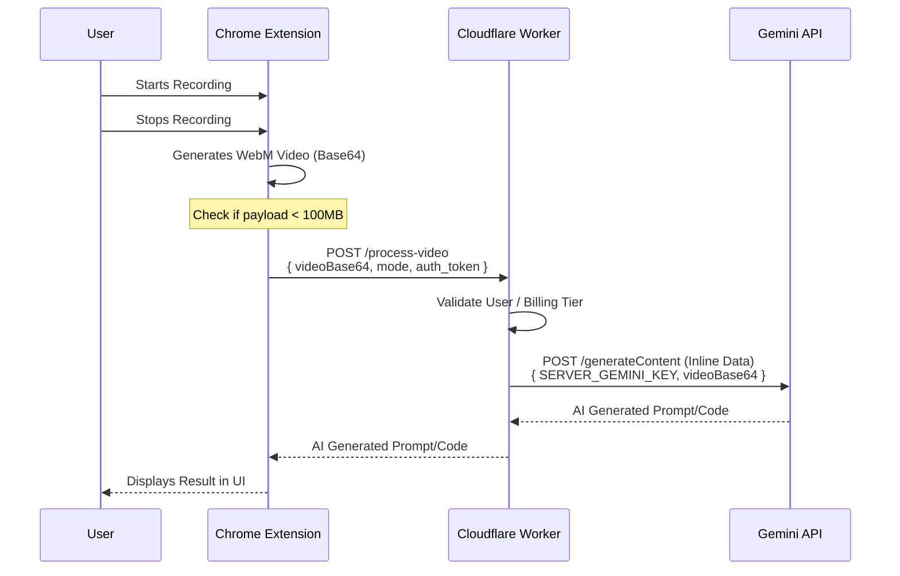
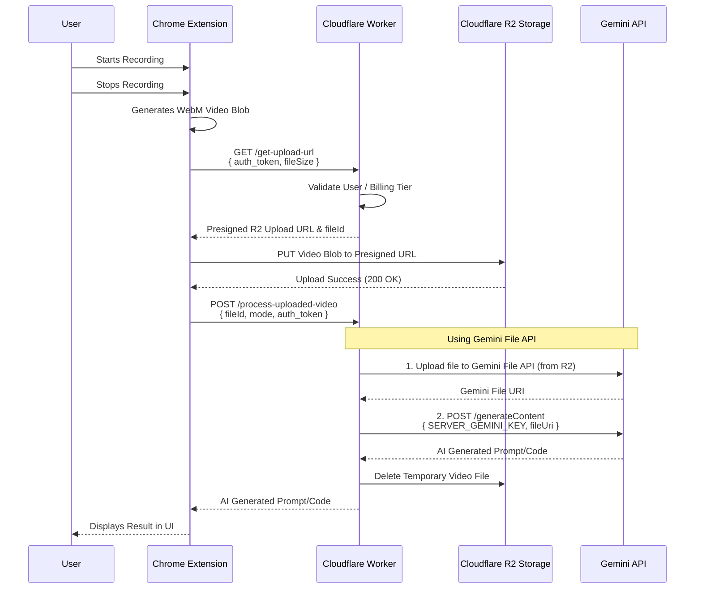

# Backend Migration Architecture for Gemini Screen Scribe

This document details the architectural options for migrating the Gemini API calls from the Chrome extension (client-side) to a server-side model using Cloudflare Workers. This transition will allow the extension to use a server-based API key, removing the need for users to manually input their keys, paving the way for a future billing model.

## 1. Context and Limitations

Currently, the extension captures the screen recording and passes it as a base64 encoded string directly to the Gemini API (`@google/genai` SDK) using **Inline Data**.

**Gemini API Video Size Limits:**
*   **Inline Data:** The maximum payload size for inline data (like base64) is **100MB**. This is suitable for short clips (typically <1 minute depending on resolution).
*   **File API / Google Cloud Storage:** For files larger than 100MB (up to 20GB paid / 2GB free) or for long videos (10min+), the Gemini File API or Cloud Storage Registration is required.

Given these constraints and the desire to use Cloudflare Workers, we have two primary architectural options.

## 2. Architectural Options

### Option 1: Direct Upload via Cloudflare Worker (For Small Videos < 100MB)

If we enforce a strict recording time limit on the extension to ensure the video payload never exceeds the ~100MB base64 limit, we can send the video directly to a Cloudflare Worker, which will then proxy the request to the Gemini API using Inline Data.

**Pros:**
*   Simplest architecture.
*   No intermediate storage required (lower latency, lower cost).
*   Easy to implement.

**Cons:**
*   Strict duration/size limits on recordings.
*   High bandwidth usage on the worker per request.
*   Cloudflare Workers have payload size limits (default 100MB for Workers, but base64 encoding inflates size by ~33%, meaning the actual video file must be smaller than ~75MB).

**Flow Diagram:**

---

### Option 2: Presigned Uploads with Cloudflare R2 (For Larger Videos & Scalability)

To bypass payload size limits and handle longer, higher-quality recordings, the extension should upload the video directly to cloud storage (e.g., Cloudflare R2). The worker will orchestrate the upload via presigned URLs and then use the Gemini File API to process the stored video.

**Pros:**
*   Handles large video files (>100MB).
*   Offloads heavy file transfer from the Worker to R2.
*   More robust and scalable for a production SaaS.
*   Videos are temporarily stored, allowing for retry logic or history features if needed.

**Cons:**
*   More complex architecture.
*   Requires integrating Cloudflare R2.
*   Slightly higher latency due to the multi-step upload process.
*   Requires managing file cleanup (e.g., R2 lifecycle policies to delete videos after processing).

**Flow Diagram:**

## 3. Recommendation

For the initial rollout to support the new billing model, **Option 1 (Direct Upload)** is the fastest to implement, assuming the current extension enforces a reasonable recording timeout.

However, as the user base grows and if users demand longer recordings (e.g., full app walkthroughs), migrating to **Option 2 (Presigned Uploads with R2)** will be necessary to ensure stability and bypass the 100MB inline and worker payload limits.
